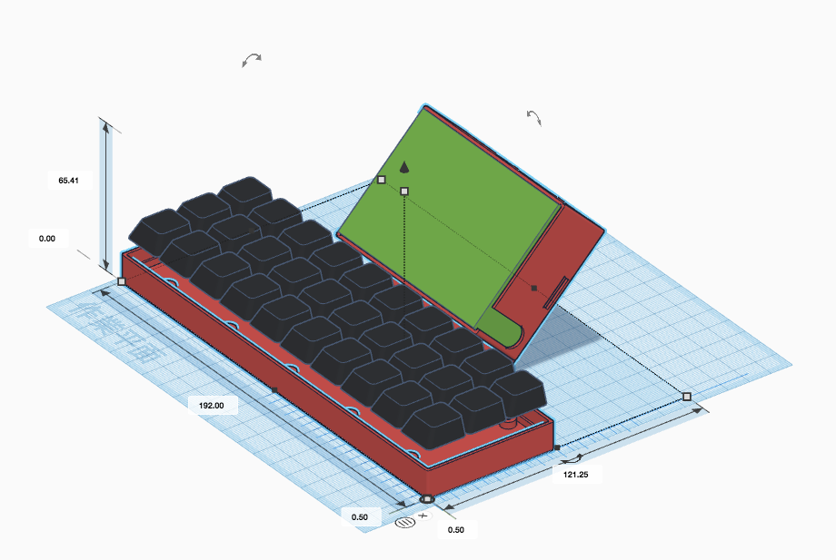

# Pikey

This is 30 keys Keyboard and enclosure with integrated stand for Raspberry Pi 2,3,3+ and 3.5 inch display.

* PCB
	* Gerber data
	* KiCad project
	* Schematic
	* Artwork
	* BOM
* Firmware
	* QMK Keyboard source file
* Document
	* Not yet.
* 3D model
	* STL file
	* [Tinkercad](https://www.tinkercad.com/things/kkT37oe7HXW)

